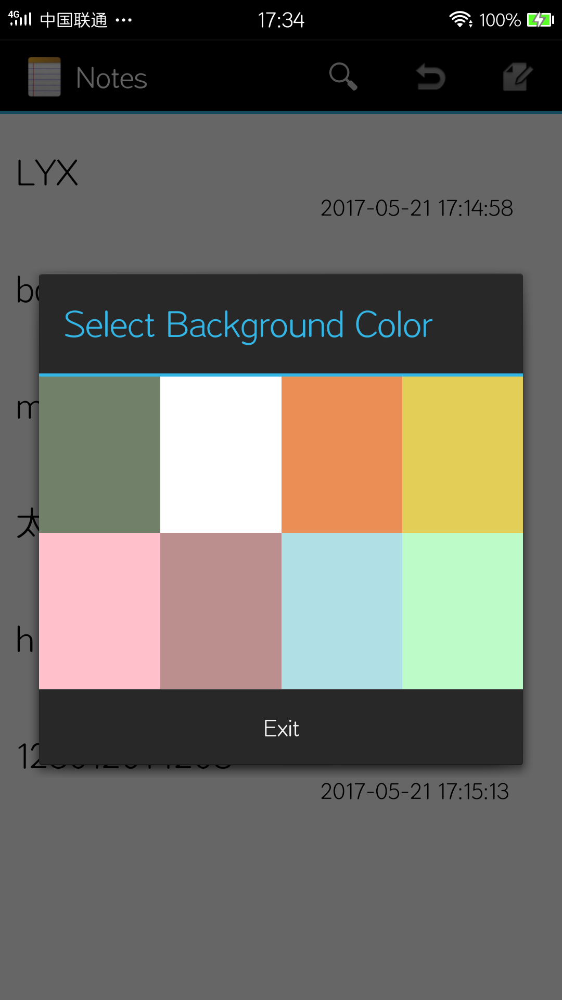

# NotePad

## 应用功能————基础功能

### 添加时间戳
找到NoteList的ItemStyle -->lauout/notelist_item.xml，这个xml是定义ListView每个Item的样式，修改它就行了。

<RelativeLayout
    xmlns:android="http://schemas.android.com/apk/res/android"
    android:layout_width="match_parent"
    android:layout_height="wrap_content"
    android:padding="5dp">

    <TextView xmlns:android="http://schemas.android.com/apk/res/android"
        android:id="@android:id/text1"
        android:layout_width="match_parent"
        android:textColor="@android:color/black"
        android:layout_height="?android:attr/listPreferredItemHeight"
        android:textAppearance="?android:attr/textAppearanceLarge"
        android:gravity="center_vertical"
        android:paddingLeft="5dip"
        android:singleLine="true"
    />
    <TextView
        android:layout_width="match_parent"
        android:layout_height="?android:attr/listPreferredItemHeight"
        android:id="@+id/cdate_text"
        android:textColor="@android:color/black"
        android:text="2017-04-26 20:20:20"
        android:layout_alignRight="@android:id/text1"
        android:paddingLeft="200dip"
        android:gravity="bottom"/>
</RelativeLayout>

进入notelist.java，点击应用之后它就加载数据
final Cursor cursor = managedQuery(
            getIntent().getData(),            // Use the default content URI for the provider.
            PROJECTION,                       // Return the note ID and title for each note.
            null,                             // No where clause, return all records.
            null,                             // No where clause, therefore no where column values.
          //  NotePad.Notes.DEFAULT_SORT_ORDER  // Use the default sort order.
           null
        );

下面这个适配器就是用来显示数据的
private SimpleCursorAdapter adapter;
...

// SimpleCursorAdapter adapter
adapter
    = new SimpleCursorAdapter(
                      this,                             // The Context for the ListView
                      R.layout.noteslist_item,          // Points to the XML for a list item
                      cursor,                           // The cursor to get items from
                      dataColumns,
                      viewIDs
    );

NodePadProvider类
public void onCreate(SQLiteDatabase db) {
           db.execSQL("CREATE TABLE " + NotePad.Notes.TABLE_NAME + " ("
                   + NotePad.Notes._ID + " INTEGER PRIMARY KEY,"
                   + NotePad.Notes.COLUMN_NAME_TITLE + " TEXT,"
                   + NotePad.Notes.COLUMN_NAME_NOTE + " TEXT,"
                   + NotePad.Notes.COLUMN_NAME_CREATE_DATE + " TEXT,"
                   //+ NotePad.Notes.COLUMN_NAME_CREATE_DATE + " INTEGER,"
                  // + NotePad.Notes.COLUMN_NAME_MODIFICATION_DATE + " INTEGER"
                   + NotePad.Notes.COLUMN_NAME_MODIFICATION_DATE + " TEXT"
                   + ");");
       }

### 模糊查询
借鉴别人的方法，来到NoteList，创建一个SearchView成员变量：//成员变量：SearchView组件
    private SearchView searchView;
看他博客是在onCreateOptionsMenu 里面初始化样式的，就跟着做呗。@Override
    public boolean onCreateOptionsMenu(Menu menu) {
        // Inflate menu from XML resource
        MenuInflater inflater = getMenuInflater();
        inflater.inflate(R.menu.list_options_menu, menu);
        setSearchView(menu);//添加搜索框
        ...
 /**
     * 设置查询菜单项
     * @param menu
     */
    private void setSearchView(Menu menu) {
        //1.找到menuItem并动态设置SearchView
        MenuItem item = menu.getItem(0);
        searchView = new SearchView(this);
        item.setActionView(searchView);

        //2.设置搜索的背景为白色
        if (Build.VERSION.SDK_INT >= Build.VERSION_CODES.ICE_CREAM_SANDWICH) {
            item.collapseActionView();
        }
        searchView.setQuery("", false);
        //searchView.setBackgroundResource(R.drawable.ic_menu_edit);
        //3.设置为默认展开状态，图标在外面
        searchView.setIconifiedByDefault(true);
        searchView.setQueryHint("Search");
        

//还原显示所有的数据
        case R.id.menu_all:
          Cursor cursor = getContentResolver().query
                  (getIntent().getData(),PROJECTION,null,null,null);
          adapter.swapCursor(null);
          adapter.swapCursor(cursor);
            return true;
这里面whereClause和Args填空值就没有where了,就显示全部信息了。

## 应用功能————附加功能

### 修改背景颜色
这一块自己不是很会，借鉴了别人的

因为是自定义的颜色按钮（textView点击事件），用户偏好设置要自己保存到SharedPreferences，新建一个类，获取和保存SharedPreferences的键值对：public class PreferencesService {
    private Context context;

    public PreferencesService(Context context) {
        this.context = context;
    }

    /**
     * 保存参数
     * @param color 颜色ID
     * @param sortType 排序类型
     */
    public void save(int color,int sortType) {
        //获得SharedPreferences对象
        SharedPreferences preferences = context.getSharedPreferences("pdata", Context.MODE_PRIVATE);
        SharedPreferences.Editor editor = preferences.edit();
        editor.putInt("color", color);
        editor.putInt("sort", sortType);
        editor.commit();
    }

    /**
     * 获取各项参数
     * @return
     */
    public Map<String, String> getPerferences() {
        Map<String, String> params = new HashMap<String, String>();
        SharedPreferences preferences = context.getSharedPreferences("pdata", Context.MODE_PRIVATE);
        params.put("color", String.valueOf(preferences.getInt("color", 0)));
        params.put("sort", String.valueOf(preferences.getInt("sort", 0)));
        return params;
    }

}

list_options_menu添加颜色菜单，其实就是在右上角列表里的一个按钮:<!-- 背景颜色 -->
    <item android:id="@+id/menu_color"
        android:title="@string/menu_color"
        android:alphabeticShortcut='c' />NoteList里添加一个操作配置文件和一个属性保存背景颜色值的属性：//偏好设置
private PreferencesService service;
//背景颜色
private int color;
NoteList-->OnCreate加载时需要加载配置文件，并获取配置文件中的颜色值//设置背景色
        service = new PreferencesService(this);
        //获取配置文件的键值对
        Map<String, String> params = service.getPerferences();
        //获取颜色值
        String value = params.get("color");
        if(!"0".equals(value))
            color= Integer.parseInt(value);
        else
            color = R.drawable.bkwhite;
        //修改背景颜色
        Resources res = getResources();
        Drawable bdrawable = res.getDrawable(color);
        this.getListView().setBackgroundDrawable(bdrawable);
择框
            case R.id.menu_color:
                //设置自定义布局
                LinearLayout form=(LinearLayout)getLayoutInflater()
                        .inflate(R.layout.color_style,null);
                final AlertDialog dialog=new AlertDialog.Builder(this)
                        .setView(form)//加载布局
                        .setTitle(R.string.title_color_list)//设置标题
                        .setPositiveButton("Exit", new DialogInterface.OnClickListener() {//退出按钮
                    @Override
                    public void onClick(DialogInterface dialog, int which) {
                    }

                })
                .create();
                dialog.show();
                //更新背景颜色
                setTextViewOnclick(dialog);
                return true;

//设置颜色点击事件监听
        color_a.setOnClickListener(new View.OnClickListener() {
            @Override
            public void onClick(View v) {
                setColor(R.drawable.bkshibanhui);
            }
        });
        color_b.setOnClickListener(new View.OnClickListener() {
            @Override
            public void onClick(View v) {
                setColor(R.drawable.bkwhite);
            }
        });

        color_c.setOnClickListener(new View.OnClickListener() {
            @Override
            public void onClick(View v) {
                setColor(R.drawable.bkdougello);
            }
        });
        color_d.setOnClickListener(new View.OnClickListener() {
            @Override
            public void onClick(View v) {
                setColor(R.drawable.bkbanana);
            }
        });
        color_e.setOnClickListener(new View.OnClickListener() {
            @Override
            public void onClick(View v) {
                setColor(R.drawable.bkfenhong);
            }
        });
        color_f.setOnClickListener(new View.OnClickListener() {
            @Override
            public void onClick(View v) {
                setColor(R.drawable.bkmeiguihong);
            }
        });
        color_g.setOnClickListener(new View.OnClickListener() {
            @Override
            public void onClick(View v) {
                setColor(R.drawable.bkqianhuilan);
            }
        });
        color_h.setOnClickListener(new View.OnClickListener() {
            @Override
            public void onClick(View v) {
                setColor(R.drawable.bkbohe);
            }
        });

    }

### 排序

